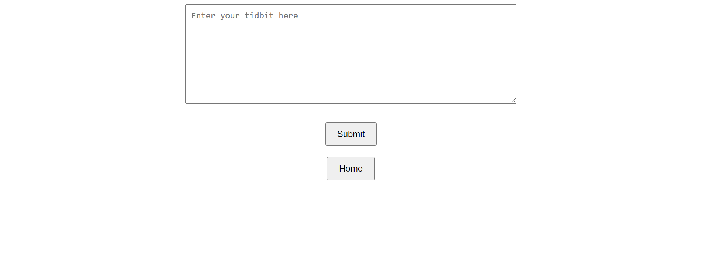

# WDILT

What Did I Learn Today: A personal learning retention app designed around spaced repetition. User can input notes, so-called "learning tidbits", that capture important learned concepts or takeaways. User can then review these learning tidbits over time.

## Functionalities

### Adding Learning Tidbits
User writes and submits a new learning tidbit on the "New Tidbits" page. A new row containing the tidbit is written to the database (implemented as a simple Google Sheets worksheet).

### Reviewing Learning Tidbits
User can examine a series of reviewable tidbits on the "Review" page. All tidbits stored in the database are scanned, and an on-the-fly calculation (an implementation of spaced repetition based on the last review date and number of times previously reviewed) is performed on each tidbit to determine whether it is up for review. 

User can then, for each tidbit shown, mark that the tidbit has been successfully reviewed. Upon termination via the "Finish" button, all tidbits marked as Reviewed will have their "last review date" and "number of times reviewed" values updated in the database. 

## Screenshots

### Home Page

### Add New Tidbits Page

### Review Tidbits Page

